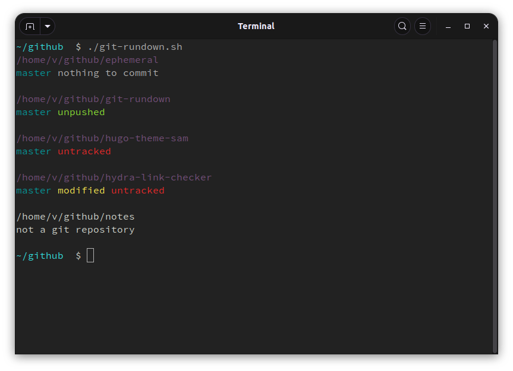

# git-rundown: 🗃 Check the status of multiple git repositories in a folder

I have a directory of git repositories, and I want to know the state of them without `cd`-ing into each one. I want a git rundown.

Forked from @mzabriskie's [git-status gist](https://gist.github.com/mzabriskie/6631607), this script provides a colorfully concise two-line output that includes the current branch name, status of modified or untracked files, as well as noting if there are unpushed commits. It looks one level deep for a git repository, and will note if the current folder isn't one.



This works really well for a directory on your machine like `~/user/github/` where you've cloned all your repositories.

## Usage

Save as a file, for example, `git-rundown.sh`. Make it executable, then run:

```bash
chmod +x git-rundown.sh
./git-rundown.sh [directory]
```

The directory argument is optional and defaults to the current directory.
